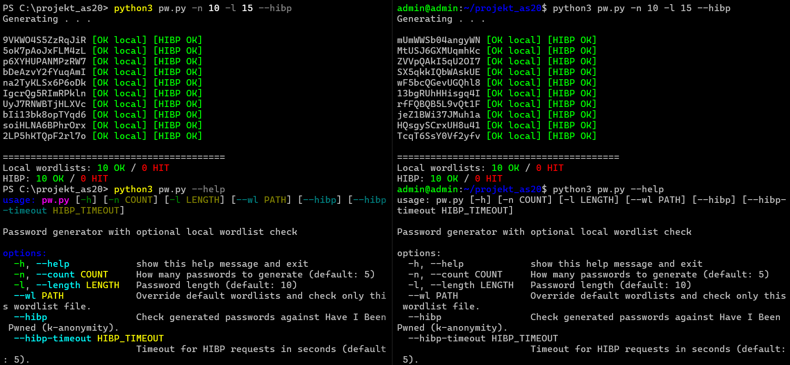

<h1 align="center">🛡️ Secure Password Generator 🛡️</h1>

A Python3-based tool to generate secure passwords and check them against local and/or remote word lists to discover potential weak outputs.  

The thought behind this is to create simple, yet secure, passwords so as to make them easy to memorize.  

This way you can combine them into much longer sequences, and add special characters where convenient, while still keeping them locked tight in your head.
  

## ⭐ Functions

- Generates random passwords with `secrets`

- Supports checking against custom word lists

- Automatically checks against 3 (three) included standardized word lists

- Uses SHA-1 for k-anonymity when checking with HIBP (the passwords never leave your terminal)

- NO storing or logging of passwords except in YOUR terminal history
   - To clear Bash: `history -c && history -w && clear`
   - To clear Pwsh: `Remove-Item (Get-PSReadLineOption).HistorySavePath`

## ⚙️ How-To-Use

1. Install Python 3 if you haven't already, get it at https://www.python.org/downloads/

2. Open the `projekt_as20` folder in your terminal of choice

3. Run `python3 pw.py`
   - Run `python3 pw.py --help` to see all flags

## 📄 Documentation

Below you can see a side-by-side of the script running on both Windows and Debian

  

Further documentation can be found in `docs/`:

- `docs/overview.md` – Project overview.
- `docs/usage.md` – Usage.
- `docs/design.md` – Design and safety.
